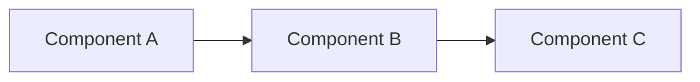

# Vuls Documentation

This directory contains the complete documentation for the Vuls Vulnerability Management System, built with MkDocs Material.

## 📚 Documentation Structure

```
docs/
├── index.md                    # Main documentation homepage
├── getting-started/            # Installation and setup guides
│   ├── index.md               # Getting started overview
│   ├── installation.md        # Installation instructions
│   ├── configuration.md       # Configuration guide (planned)
│   └── first-scan.md          # First scan tutorial (planned)
├── user-guide/                # User operation guides
│   ├── index.md               # User guide overview
│   ├── monthly-scanning.md    # Monthly scanning workflow
│   ├── reporting.md           # Report generation guide
│   ├── vulnerability-analysis.md  # Analysis guide (planned)
│   └── web-interface.md       # Web UI guide (planned)
├── development/               # Developer documentation
│   ├── index.md               # Development overview
│   ├── architecture.md        # System architecture (planned)
│   ├── web-app-dev.md         # Web app development (planned)
│   ├── api-reference.md       # API documentation (planned)
│   └── contributing.md        # Contributing guidelines (planned)
├── reference/                 # Reference documentation
│   ├── index.md               # Reference overview (planned)
│   ├── database-schema.md     # Database documentation (planned)
│   ├── configuration-options.md  # Config reference (planned)
│   ├── troubleshooting.md     # Troubleshooting guide (planned)
│   └── version-history.md     # Changelog (planned)
└── deployment/                # Deployment guides
    ├── index.md               # Deployment overview (planned)
    ├── docker-setup.md        # Docker deployment (planned)
    ├── production.md          # Production setup (planned)
    └── security.md            # Security guidelines (planned)
```

## 🚀 Quick Start

### View Documentation Locally

```bash
# Serve documentation with hot reload
./serve-docs.sh

# Or manually:
uv run mkdocs serve --dev-addr=0.0.0.0:8002
```

The documentation will be available at: http://localhost:8002

### Build Static Documentation

```bash
# Build static site
uv run mkdocs build

# Output will be in ./site/ directory
```

## ✅ What's Been Migrated

### ✅ Completed Sections

- **Homepage** (`index.md`) - Complete overview with architecture diagrams
- **Getting Started** (`getting-started/`) - Installation guide and overview
- **User Guide** (`user-guide/`) - Monthly scanning workflow and reporting
- **Development** (`development/`) - Development overview and guidelines

### 📝 Content Successfully Migrated

1. **Main README.md** → `docs/user-guide/monthly-scanning.md`
   - Complete monthly vulnerability scanning workflow
   - Database update procedures
   - SSH configuration and troubleshooting
   - Compliance considerations
   - Automation scripts

2. **Vulnerability Reports README** → `docs/user-guide/reporting.md`
   - Interactive HTML report generation
   - Report customization and themes
   - Automation and distribution
   - Analysis tools and best practices

3. **Web Application Documentation** → `docs/development/index.md`
   - Development environment setup
   - Technology stack overview
   - Architecture patterns
   - Security considerations

4. **Vulnerability Analysis Summary** → Integrated throughout documentation
   - OVAL vs GOST database explanations
   - OS version compatibility matrices
   - Zero vulnerability interpretation guides

## 🎨 Features

### Modern Documentation Site

- **Material Design**: Clean, professional appearance
- **Dark/Light Themes**: User preference support
- **Mobile Responsive**: Works on all devices
- **Search**: Full-text search across all documentation

### Interactive Elements

- **Mermaid Diagrams**: System architecture visualizations
- **Code Highlighting**: Syntax highlighting for multiple languages
- **Tabbed Content**: Organized information presentation
- **Admonitions**: Warning, info, and tip callouts

### Navigation

- **Tabbed Navigation**: Organized by user type (Getting Started, User Guide, Development)
- **Section Navigation**: Clear hierarchy within each section
- **Cross-References**: Links between related topics
- **Table of Contents**: Auto-generated TOC for each page

## 🔧 Configuration

### MkDocs Configuration (`mkdocs.yml`)

Key features configured:

- **Material Theme**: Professional appearance with custom colors
- **Mermaid Plugin**: Architecture diagrams support
- **Search Plugin**: Enhanced search functionality
- **Markdown Extensions**: Advanced formatting capabilities

### Theme Customization

- **Primary Color**: Red (matching vulnerability theme)
- **Code Highlighting**: Python, Bash, YAML, JSON, TOML
- **Social Links**: GitHub repository and Docker Hub
- **Navigation**: Structured for different user types

## 📋 Content Guidelines

### Writing Style

- **Clear and Concise**: Easy to understand instructions
- **Step-by-Step**: Logical progression through tasks
- **Code Examples**: Practical, working examples
- **Visual Aids**: Diagrams and screenshots where helpful

### Markdown Standards

- **Headers**: Use proper hierarchy (H1 → H2 → H3)
- **Code Blocks**: Include language specification
- **Links**: Use descriptive link text
- **Lists**: Consistent formatting and indentation

### Documentation Types

- **Tutorials**: Step-by-step learning guides
- **How-To Guides**: Problem-solving instructions
- **Reference**: Technical specifications
- **Explanations**: Conceptual understanding

## 🚧 Planned Additions

### High Priority

- [ ] Configuration guide (`getting-started/configuration.md`)
- [ ] First scan tutorial (`getting-started/first-scan.md`)
- [ ] Web interface guide (`user-guide/web-interface.md`)
- [ ] Vulnerability analysis guide (`user-guide/vulnerability-analysis.md`)

### Medium Priority

- [ ] System architecture (`development/architecture.md`)
- [ ] Web app development guide (`development/web-app-dev.md`)
- [ ] API reference (`development/api-reference.md`)
- [ ] Contributing guidelines (`development/contributing.md`)

### Lower Priority

- [ ] Complete reference section
- [ ] Deployment guides
- [ ] Troubleshooting database
- [ ] Version history and changelog

## 🔄 Migration Status

### Original Documentation Sources

- ✅ **README.md** (Main) → Monthly scanning workflow
- ✅ **vulnerability-reports/README.md** → Report generation
- ✅ **web-app/DEVELOPMENT.md** → Development guide
- ✅ **WEB_APPLICATION_SUMMARY.md** → Architecture overview
- ✅ **VULNERABILITY_ANALYSIS_SUMMARY.md** → Analysis concepts
- ⏳ **README_VERSIONS.md** → Version history (planned)

### Benefits of Migration

1. **Centralized Documentation**: All docs in one searchable site
2. **Professional Appearance**: Modern, responsive design
3. **Better Organization**: Logical structure for different user types
4. **Enhanced Navigation**: Easy to find relevant information
5. **Version Control**: Documentation versioned with code
6. **Maintenance**: Easier to keep documentation up-to-date

## 🛠 Development

### Adding New Pages

1. Create markdown file in appropriate directory
2. Add to navigation in `mkdocs.yml`
3. Test locally with `./serve-docs.sh`
4. Build and verify with `uv run mkdocs build`

### Updating Existing Content

1. Edit markdown files directly
2. Use hot reload for immediate preview
3. Follow existing style and structure
4. Update cross-references as needed

### Adding Diagrams

Use Mermaid syntax for diagrams:



## 📊 Analytics

The documentation includes:

- **Navigation tracking**: Which sections are most visited
- **Search analytics**: What users are looking for
- **Page performance**: Loading times and user engagement

## 🤝 Contributing

To contribute to the documentation:

1. Follow the existing structure and style
2. Test changes locally before submitting
3. Update navigation if adding new pages
4. Include relevant cross-references
5. Use clear, concise language

## 📞 Support

For documentation issues:

- **Content Issues**: Create GitHub issue with "documentation" label
- **Technical Issues**: Check MkDocs Material documentation
- **Suggestions**: Use GitHub discussions for improvement ideas

---

**The documentation is now centralized, searchable, and professionally presented with MkDocs Material!**
