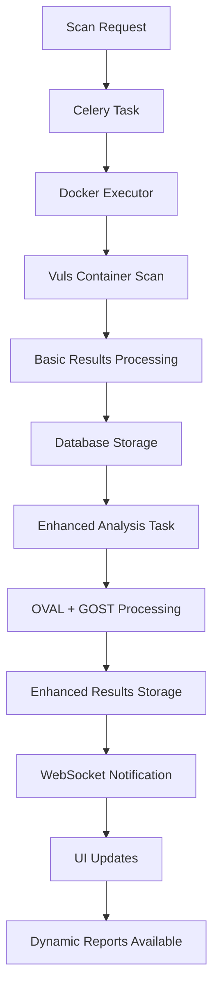

# Enhanced Vulnerability Analysis Integration

## Overview

The enhanced vulnerability analysis system integrates your comprehensive vulnerability checker with the web application, providing automated processing of scan results using OVAL, GOST, and CVE databases.

## Architecture

### Core Components

#### 1. Enhanced Vulnerability Service

- **File**: `web-app/app/services/enhanced_vulnerability_service.py`
- **Purpose**: Integrates the `ComprehensiveVulnerabilityChecker` class
- **Features**:
  - OVAL, GOST, and CVE database integration
  - Intelligent package filtering and version comparison
  - Source deduplication (OVAL, GOST, BASIC)

#### 2. Worker-Based Processing

- **File**: `web-app/app/tasks/vulnerability_analysis_tasks.py`
- **Purpose**: Automated background processing
- **Features**:
  - Celery task `enhanced_vulnerability_analysis`
  - Runs automatically after successful scans
  - WebSocket notifications on completion

#### 3. Database Models

- **Vulnerability Model**: Enhanced with source tracking
- **VulnerabilityAnalysis Model**: Summary data storage
- **Scan Model**: Analysis tracking and status
- **Host Model**: Latest scan properties

#### 4. API Endpoints

- **File**: `web-app/app/api/vulnerabilities.py`
- **Endpoints**:
  - `/api/hosts/{host_id}/vulnerabilities` - Host-specific vulnerabilities
  - `/api/scans/{scan_id}/vulnerabilities` - Scan vulnerabilities
  - `/api/scans/{scan_id}/vulnerability-report` - HTML reports
  - `/api/vulnerability-statistics` - Overall statistics

## Web Interface

### HTML Pages

#### Dashboard (`/`)

- Real-time vulnerability statistics
- Host overview with analysis status
- Navigation to detailed pages

#### Hosts Page (`/hosts`)

- Interactive host management
- Vulnerability counts per host
- Enhanced analysis indicators
- Scan initiation capabilities

#### Scans Page (`/scans`)

- Comprehensive scan listing
- Status filtering (completed, running, failed, pending)
- Analysis type filtering (enhanced, basic)
- Direct links to reports

#### Reports Page (`/reports`)

- Host-specific report generation
- Summary report options
- Report statistics and management

#### Host Vulnerability Details (`/hosts/{host_id}/vulnerabilities`)

- Detailed vulnerability analysis per host
- Interactive filtering by severity and source
- Historical scan tracking

### Template Architecture

#### Separated Templates

- **Templates**: `web-app/app/templates/`
- **Services**: `web-app/app/services/vulnerability_report_service.py`
- **Benefits**: Clean separation of presentation and business logic

#### Dynamic Reports

- Professional HTML reports with TailwindCSS
- Interactive charts using Chart.js
- Print-friendly styling
- Dark/light mode support

## Integration Flow



## Database Schema

### Enhanced Columns Added

#### Scans Table

```sql
ALTER TABLE scans ADD COLUMN enhanced_analysis_completed BOOLEAN DEFAULT FALSE;
ALTER TABLE scans ADD COLUMN enhanced_analysis_started_at TIMESTAMP WITH TIME ZONE;
ALTER TABLE scans ADD COLUMN enhanced_analysis_completed_at TIMESTAMP WITH TIME ZONE;
```

#### Vulnerabilities Table

- `source` column for tracking vulnerability source (OVAL, GOST, BASIC)

#### VulnerabilityAnalysis Table

- Summary data for enhanced analysis results
- Source breakdown and severity statistics
- High-risk package identification

## Configuration

### Database Paths

The system uses mounted database paths:

- **OVAL DB**: `/app/db/oval.sqlite3`
- **GOST DB**: `/app/db/gost.sqlite3`
- **CVE DB**: `/app/db/cve.sqlite3`

### Environment Variables

- Database connection configured via `DATABASE_URL`
- Redis connection for WebSocket notifications
- Celery configuration for background tasks

## Usage

### Automatic Processing

1. Scan completes successfully
2. Enhanced analysis task automatically triggered
3. OVAL and GOST databases processed
4. Results stored with source tracking
5. WebSocket notification sent to UI
6. Reports become available

### Manual Access

1. **Dashboard**: Visit `/` for overview
2. **Host Management**: Use `/hosts` for host operations
3. **Scan History**: View `/scans` for scan management
4. **Report Generation**: Access `/reports` for report options

### API Integration

- RESTful endpoints for programmatic access
- JSON responses for all data
- Filtering capabilities for targeted queries

## Features

### Real-time Updates

- WebSocket notifications when analysis completes
- Live dashboard statistics
- Status indicators for enhanced vs basic analysis

### Professional Reports

- Dynamic HTML generation from database data
- Charts and visualizations
- Comprehensive vulnerability details
- Export capabilities

### Enhanced Analysis

- Comprehensive package vulnerability detection
- Version comparison and validation
- Source deduplication and prioritization
- Risk scoring and categorization

## Development Notes

### Code Organization

- Services separated from templates
- DRY principles applied throughout
- Logical file organization by functionality

### Dark/Light Mode Support

- All interfaces support theme switching
- Consistent styling across components
- Responsive design for all screen sizes

### Hot Reload Support

- Development container reloads on code changes
- No restart required for template updates
- Efficient development workflow
