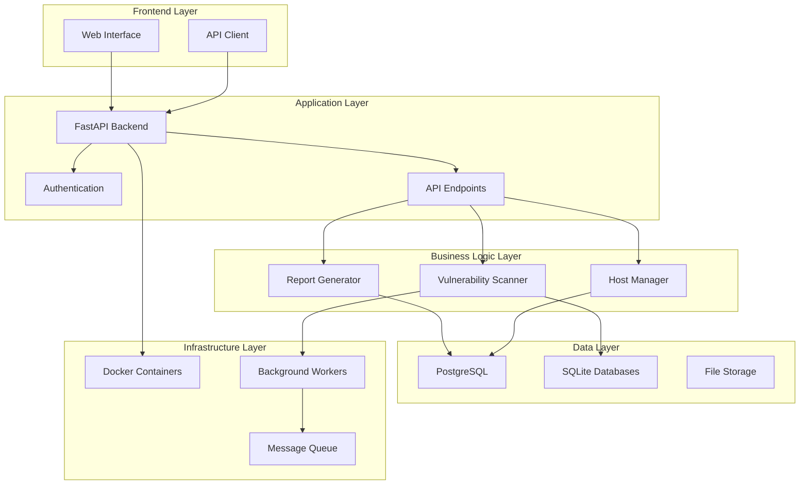

# Development

This section provides technical documentation for developers working on the Vuls Vulnerability Management System.

## Overview

The Vuls system is built with modern technologies and follows best practices for containerized applications. Whether you're contributing to the core system, developing integrations, or customizing the platform, this section will guide you through the development process.

## What You'll Find Here

### [Architecture](architecture.md)

Comprehensive overview of the system architecture, including:

- System components and their interactions
- Database design and relationships
- Container orchestration with Docker Compose
- API design patterns and conventions
- Security architecture and authentication flows

### [Web Application Development](web-app-dev.md)

Detailed guide for developing the web interface:

- Development environment setup with hot reload
- FastAPI backend development
- Frontend development with TailwindCSS and Alpine.js
- Database models and migrations
- Authentication and authorization implementation

### [API Reference](api-reference.md)

Complete API documentation:

- RESTful endpoint specifications
- Authentication and authorization
- Request/response formats
- Error handling and status codes
- Integration examples and SDKs

### [Contributing](contributing.md)

Guidelines for contributing to the project:

- Development workflow and Git practices
- Code style and formatting standards
- Testing procedures and requirements
- Pull request process and review guidelines
- Community guidelines and communication

### [Task Scheduler Fix](task-scheduler-fix.md)

Documentation of the Docker executor implementation fix:

- Problem analysis and root cause identification
- Solution implementation with direct Docker run commands
- Dynamic path resolution for containerized environments
- Testing and verification procedures
- Troubleshooting guide for SSH connectivity issues

### [Real-Time WebSocket System](websocket-realtime-system.md)

Documentation of the real-time notification system:

- WebSocket architecture and Redis pub/sub implementation
- Real-time task completion notifications
- Performance improvements over polling-based updates
- Configuration and troubleshooting guide
- Security considerations and future enhancements

## Technology Stack

### Backend Technologies

- **FastAPI**: Modern, fast web framework for building APIs
- **SQLAlchemy**: SQL toolkit and Object-Relational Mapping (ORM)
- **PostgreSQL**: Primary application database
- **SQLite**: Vulnerability databases (OVAL, GOST, CVE)
- **Celery**: Distributed task queue for background processing
- **Redis**: Message broker and caching

### Frontend Technologies

- **TailwindCSS**: Utility-first CSS framework
- **Alpine.js**: Lightweight JavaScript framework
- **Chart.js**: Interactive charts and visualizations
- **Jinja2**: Template engine for server-side rendering

### Infrastructure

- **Docker**: Containerization platform
- **Docker Compose**: Multi-container orchestration
- **uv**: Fast Python package manager
- **MkDocs Material**: Documentation site generator

## Development Principles

### Code Quality

- **Type Hints**: Full Python type annotation
- **Linting**: Automated code quality checks
- **Testing**: Comprehensive test coverage
- **Documentation**: Inline and external documentation

### Security First

- **Input Validation**: Strict input sanitization
- **Authentication**: JWT-based secure authentication
- **Authorization**: Role-based access control
- **Secrets Management**: Secure handling of sensitive data

### Performance

- **Async Operations**: Non-blocking I/O operations
- **Database Optimization**: Efficient queries and indexing
- **Caching**: Strategic use of caching layers
- **Resource Management**: Efficient container resource usage

### Maintainability

- **Modular Design**: Clear separation of concerns
- **Configuration Management**: Environment-based configuration
- **Logging**: Comprehensive logging and monitoring
- **Error Handling**: Graceful error handling and recovery

## Development Workflow

### 1. Environment Setup

```bash
# Clone the repository
git clone https://github.com/your-org/vuls-vulnerability-scanner.git
cd vuls-vulnerability-scanner

# Set up development environment
./web-app/start-dev.sh

# Install development dependencies
uv sync --dev
```

### 2. Development Process

```bash
# Create feature branch
git checkout -b feature/new-functionality

# Make changes with hot reload
# Edit files in web-app/app/ or docs/

# Test changes
uv run pytest

# Commit changes
git add .
git commit -m "feat: add new functionality"

# Push and create pull request
git push origin feature/new-functionality
```

### 3. Testing

```bash
# Run unit tests
uv run pytest tests/

# Run integration tests
uv run pytest tests/integration/

# Run with coverage
uv run pytest --cov=app tests/

# Run specific test file
uv run pytest tests/test_vulnerabilities.py
```

## Architecture Overview



## Key Components

### Vulnerability Scanner Engine

- **OVAL Integration**: Operating system vulnerability definitions
- **GOST Integration**: Go Security Tracker for Ubuntu-specific data
- **CVE Database**: Common Vulnerabilities and Exposures
- **Version Comparison**: Intelligent package version analysis

### Web Application Framework

- **RESTful API**: Clean, consistent API design
- **Real-time Updates**: WebSocket integration for live updates
- **Responsive UI**: Mobile-friendly interface design
- **Interactive Reports**: Dynamic charts and filtering

### Database Architecture

- **Application Data**: User accounts, hosts, scan metadata
- **Vulnerability Data**: CVE details, OVAL definitions, GOST data
- **Relationships**: Proper foreign key constraints and indexing
- **Migrations**: Version-controlled schema changes

### Background Processing

- **Scan Orchestration**: Automated vulnerability scanning
- **Report Generation**: Background report processing
- **Database Updates**: Scheduled vulnerability database updates
- **Cleanup Tasks**: Automated maintenance and archival

## Development Tools

### Code Quality Tools

```bash
# Format code
uv run black .
uv run isort .

# Lint code
uv run flake8 .
uv run mypy .

# Security scanning
uv run bandit -r app/
```

### Database Tools

```bash
# Create migration
uv run alembic revision --autogenerate -m "description"

# Apply migrations
uv run alembic upgrade head

# Database shell
docker exec -it vuls-db psql -U vuls -d vuls
```

### Documentation Tools

```bash
# Serve documentation locally
uv run mkdocs serve

# Build documentation
uv run mkdocs build

# Deploy documentation
uv run mkdocs gh-deploy
```

## Integration Points

### External Systems

- **SIEM Integration**: Forward vulnerability data to security systems
- **Ticketing Systems**: Create tickets for vulnerability remediation
- **Configuration Management**: Track system changes and updates
- **Monitoring Systems**: Health checks and performance metrics

### API Integrations

- **REST API**: Full programmatic access to functionality
- **Webhooks**: Event-driven notifications and updates
- **Bulk Operations**: Efficient handling of large datasets
- **Rate Limiting**: Protect against abuse and overload

## Performance Considerations

### Scalability

- **Horizontal Scaling**: Multiple worker containers
- **Database Optimization**: Proper indexing and query optimization
- **Caching Strategy**: Redis for frequently accessed data
- **Load Balancing**: Distribute requests across instances

### Resource Management

- **Memory Usage**: Efficient data structures and garbage collection
- **CPU Utilization**: Async operations and worker pools
- **Disk I/O**: Optimized database queries and file operations
- **Network**: Efficient API design and data transfer

## Security Considerations

### Application Security

- **Input Validation**: Comprehensive input sanitization
- **SQL Injection Prevention**: Parameterized queries and ORM usage
- **XSS Protection**: Template auto-escaping and CSP headers
- **CSRF Protection**: Token-based request validation

### Infrastructure Security

- **Container Security**: Minimal base images and security scanning
- **Network Security**: Proper firewall rules and network isolation
- **Secrets Management**: Environment variables and secret stores
- **Access Control**: Role-based permissions and audit logging

## Getting Started

Ready to start developing? Here's your next steps:

1. **[Set up your development environment](web-app-dev.md)** - Get the development stack running
2. **[Understand the architecture](architecture.md)** - Learn how the system works
3. **[Review the API documentation](api-reference.md)** - Understand the available endpoints
4. **[Read the contributing guidelines](contributing.md)** - Learn our development practices

## Community

- **GitHub Issues**: Report bugs and request features
- **Discussions**: Ask questions and share ideas
- **Pull Requests**: Contribute code and documentation
- **Code Reviews**: Participate in the review process

---

**Ready to contribute?** Start with the [Web Application Development Guide](web-app-dev.md) to set up your development environment.
