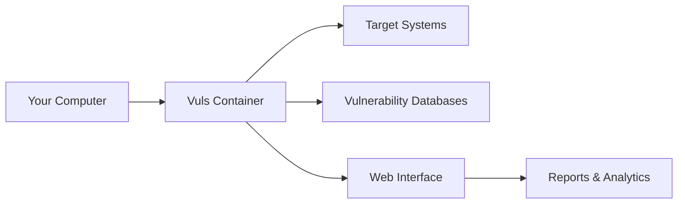

# Getting Started

Welcome to Vuls! This section will guide you through the initial setup and configuration of your vulnerability management system.

## Overview

The Vuls Vulnerability Management System is designed to be easy to deploy and use. Whether you're setting up a development environment or a production system, these guides will help you get started quickly.

## What You'll Learn

- [**Installation**](installation.md) - Set up Docker, dependencies, and the Vuls system
- [**Configuration**](configuration.md) - Configure databases, SSH keys, and target systems
- [**First Scan**](first-scan.md) - Run your first vulnerability scan and generate reports

## Prerequisites

Before you begin, ensure you have:

- **Docker & Docker Compose**: Version 20.10+ recommended
- **SSH Access**: To target systems you want to scan
- **System Resources**: 4GB RAM, 10GB disk space minimum
- **Network Access**: Internet connectivity for database updates

## Quick Start Checklist

- [ ] Install Docker and Docker Compose
- [ ] Clone the Vuls repository
- [ ] Configure target systems in `config/config.toml`
- [ ] Set up SSH keys for system access
- [ ] Update vulnerability databases
- [ ] Run your first scan
- [ ] Generate and view reports

## Architecture Overview

## Support

If you encounter issues during setup:

1. Check the [Troubleshooting Guide](../reference/troubleshooting.md)
2. Review the [Configuration Reference](../reference/configuration-options.md)
3. Consult the [FAQ](../reference/troubleshooting.md#frequently-asked-questions)

---

**Ready to begin?** Start with the [Installation Guide](installation.md).
