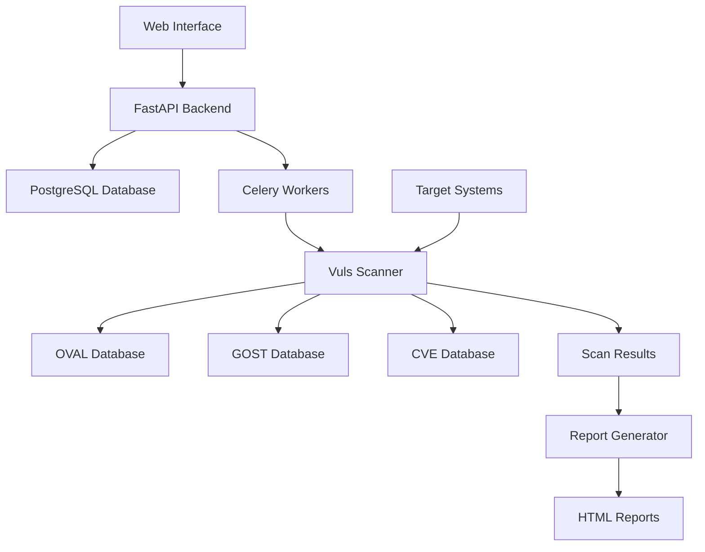

# Vuls Vulnerability Management System

Welcome to the comprehensive documentation for the Vuls Vulnerability Management System - a powerful, containerized solution for automated vulnerability scanning, analysis, and reporting.

## 🚀 Quick Start

Get up and running with Vuls in minutes:

```bash
# Clone the repository
git clone https://github.com/your-org/vuls-vulnerability-scanner.git
cd vuls-vulnerability-scanner

# Start the complete stack
docker compose --profile web up -d

# Access the web interface
open http://localhost:8000
```

## 🎯 What is Vuls?

Vuls is a comprehensive vulnerability management platform that combines:

- **Automated Scanning**: Regular vulnerability assessments using OVAL and GOST databases
- **Web Interface**: Modern, responsive dashboard for managing hosts and scans
- **Advanced Reporting**: Interactive HTML reports with charts and filtering
- **Multi-Database Support**: Integration with CVE, OVAL, GOST, and custom databases
- **Container-First**: Fully containerized with Docker Compose orchestration

## 🏗️ System Architecture



## 📊 Key Features

### 🔍 **Vulnerability Scanning**

- Support for Ubuntu, Debian, RHEL, CentOS, and Amazon Linux
- OVAL and GOST database integration
- Intelligent package filtering (206+ high-risk packages)
- Version comparison with Debian-style versioning support

### 🌐 **Web Management**

- Modern React-like interface with TailwindCSS
- Host management with SSH configuration
- Real-time scan monitoring
- User authentication and authorization

### 📈 **Advanced Analytics**

- Interactive vulnerability dashboards
- Severity distribution charts
- Timeline analysis
- Package risk scoring
- Export capabilities (PDF, CSV, JSON)

### 🐳 **Container Integration**

- Docker Compose orchestration
- Service profiles for different deployment scenarios
- Volume mapping for data persistence
- Environment-based configuration

## 📚 Documentation Sections

### [Getting Started](getting-started/index.md)

Learn how to install, configure, and run your first vulnerability scan.

### [User Guide](user-guide/index.md)

Comprehensive guides for daily operations, including monthly scanning workflows and report generation.

### [Development](development/index.md)

Technical documentation for developers, including architecture details and API references.

### [Reference](reference/index.md)

Database schemas, configuration options, troubleshooting guides, and version history.

### [Deployment](deployment/index.md)

Production deployment guides, Docker setup, and security best practices.

## 🎨 Interactive Reports

Our vulnerability reports feature:

- **Real-time Filtering**: Search and filter by CVE, package, severity
- **Visual Analytics**: Charts showing vulnerability distribution and trends
- **Export Options**: PDF, CSV, and JSON export capabilities
- **Mobile Responsive**: Works on all devices
- **Dark/Light Themes**: User preference support

## 🔧 Supported Operating Systems

| OS               | Versions                | OVAL Support | GOST Support |
| ---------------- | ----------------------- | ------------ | ------------ |
| **Ubuntu**       | 20.04, 22.04, 24.04 LTS | ✅           | ✅           |
| **Debian**       | 10, 11, 12              | ✅           | ❌           |
| **RHEL/CentOS**  | 7, 8, 9                 | ✅           | ❌           |
| **Amazon Linux** | 1, 2, 2023              | ✅           | ❌           |

!!! warning "End-of-Life Systems"
Ubuntu 16.04/18.04 and Debian 8/9 are no longer supported by vulnerability databases. Consider upgrading to supported versions for accurate scanning.

## 🚦 System Status

The system provides comprehensive monitoring:

- **Database Health**: OVAL, GOST, and CVE database status
- **Scan Progress**: Real-time scan execution monitoring
- **Host Connectivity**: SSH and cloud proxy connection status
- **Report Generation**: Background report processing status

## 🤝 Contributing

We welcome contributions! See our [Contributing Guide](development/contributing.md) for:

- Development environment setup
- Code style guidelines
- Testing procedures
- Pull request process

## 📞 Support

- **Documentation**: Browse the sections above for detailed guides
- **Issues**: Report bugs and feature requests on GitHub
- **Discussions**: Join community discussions for help and ideas

## 🔒 Security

Security is our priority:

- JWT-based authentication
- Encrypted database connections
- Secure SSH key management
- Container isolation
- Regular security updates

---

**Ready to get started?** Head to the [Installation Guide](getting-started/installation.md) to set up your vulnerability management system.
